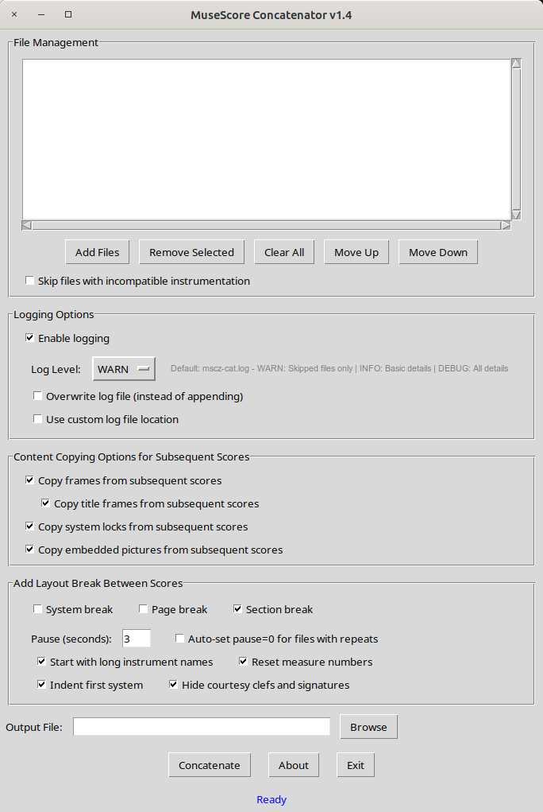

[](https://www.gnu.org/licenses/gpl-3.0.en.html)

# mscz-concatenator

This application lets you **concatenate multiple MuseScore `.mscz` files** into a single new file.

All sources must have the same part / instrument structure.

Build upon [**ms-concatenate.py**](https://github.com/Zen-Master-SoSo/mscore/blob/master/scripts/ms_concatenate.py), part of the [Zen-Master-SoSo/mscore](https://github.com/Zen-Master-SoSo/mscore) library, announced on https://linuxmusicians.com/viewtopic.php?t=28728

---



### Features 
- Combine multiple `.mscz` MuseScore files into one.
- Reorder files before concatenation.
- choose to copy frames, title frames, pictures and/or systemlocks
- eid conflict resolution
- add system break, page break or section break after each score
- Available as: - Windows standalone `.exe` and Linux executable
---

## Installation

### Option 1 — Use the prebuilt executables

#### **Linux**
Download the native executable dist/mscz-concatenator
Then make it executable and run:
```bash
chmod +x mscz-concatenator
./mscz-concatenator
````

#### **Windows**
Download: dist/mscz-concatenator.exe
Then double-click to launch. No installation required.

### Option 2 — Run from source (Linux / Windows)

Clone this repo. (keep everything in same folder)

Run the GUI:
```bash
python3 mscz-concatenator.py
````


